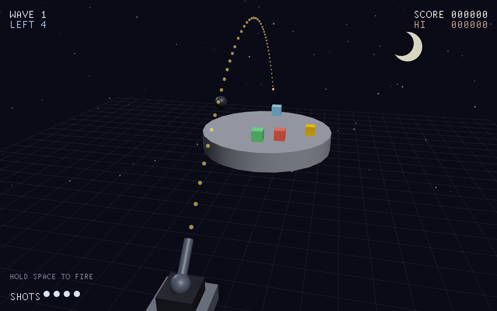
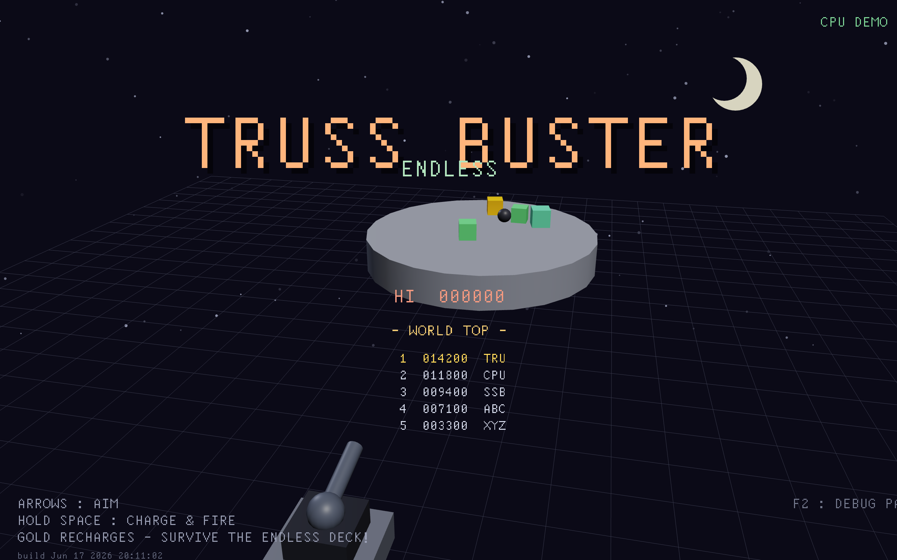

# TRUSS BUSTER ENDLESS

An endless 3D physics demolition game. A round platform spins; blocks ride it;
you knock them off with a cannon — forever. Gold recharges your shots, gray junk
clogs the deck, and stuck cannonballs become 12‑sided **bombs** you can set off
to clear a jam. There's a global leaderboard. How far can you get?

### ▶ Play in your browser: **https://tettou771.github.io/demo-trussBuster2/**





---

## 🛠️ Built with TrussC

This whole game — the 3D rendering, input, the chiptune sound effects and music
(generated at runtime, zero audio files), the bitmap‑font HUD, and the one‑command
**WebGPU/WebAssembly** export that lets it run in a browser — is built on
[**TrussC**](https://github.com/TrussC-org/TrussC), a lightweight creative‑coding
framework I'm building: an openFrameworks‑like API implemented simply in modern
C++ on top of [sokol](https://github.com/floooh/sokol).

No engine, no editor — just a small framework and a few hundred lines of game
code. Physics is [Jolt](https://github.com/jrouwe/JoltPhysics) via the bundled
`tcxPhysics` addon. The global leaderboard is a tiny Cloudflare Worker + KV. The
same source compiles to a native macOS/Windows/Linux app **and** to the browser.

If you like what you see, TrussC is the thing that made it easy. 😎

## How to play

Knock every **scoring block** off the spinning deck and a fresh wave drops in —
it never ends, it just gets harder.

- **Gold blocks** glint and recharge the cannon (+5 shots). They're your lifeline.
- **Gray junk blocks** score nothing and just clog the deck; they get heavier and
  more common the longer you survive.
- A cannonball that comes to rest on the deck stays as an armed **bomb**. The next
  shot that grazes it detonates it and scatters the nearby blocks — your escape
  hatch when the deck jams.
- Out of shots with nothing in flight = **game over**. Beat the world record and
  you get to enter your initials.

| Input | Action |
|------|--------|
| Click / tap | start (and continue after game over) |
| ← → ↑ ↓ | aim |
| hold SPACE → release | charge & fire (release in the white zone for a MAX shot) |
| SHARE button | post your run (score + link) on game over |

On phones the controls switch to an on‑screen d‑pad + FIRE button automatically.

## Build & run

Built and managed with **trusscli** (TrussC's project tool):

```bash
trusscli run            # native build + launch
trusscli build --web    # WebGPU/wasm -> bin/trussBuster2.{html,js,wasm,data}
```

The world leaderboard lives in `worldscore-worker/` (a Cloudflare Worker + KV).
Score POSTs are signed (`sha256(salt:score:initials)`) so casual fakes are
rejected; the salt is a Worker secret + a gitignored `src/Secret.h` (copy
`src/Secret.h.example`).

## Under the hood

- **Rotating deck** — a kinematic cylinder spun a little each frame; Jolt's
  `MoveKinematic` derives the angular velocity, so blocks are carried around by
  friction, just like real objects on a turntable.
- **Bombs** — a settled ball is removed and re‑spawned as a cube‑collider body
  (cubes sit still on the deck where round shapes roll off) rendered as a pulsing
  12‑sided die.
- **Audio** — every sound effect and the looping BGM are synthesized at runtime
  with TrussC's `ChipSound`. No asset files.
- **Cross‑platform** — one codebase, native + browser. The leaderboard fetch/share
  use the browser's `fetch`/`navigator.share` on web and no‑op natively.

Made with [TrussC](https://github.com/TrussC-org/TrussC) · physics by
[Jolt](https://github.com/jrouwe/JoltPhysics).
